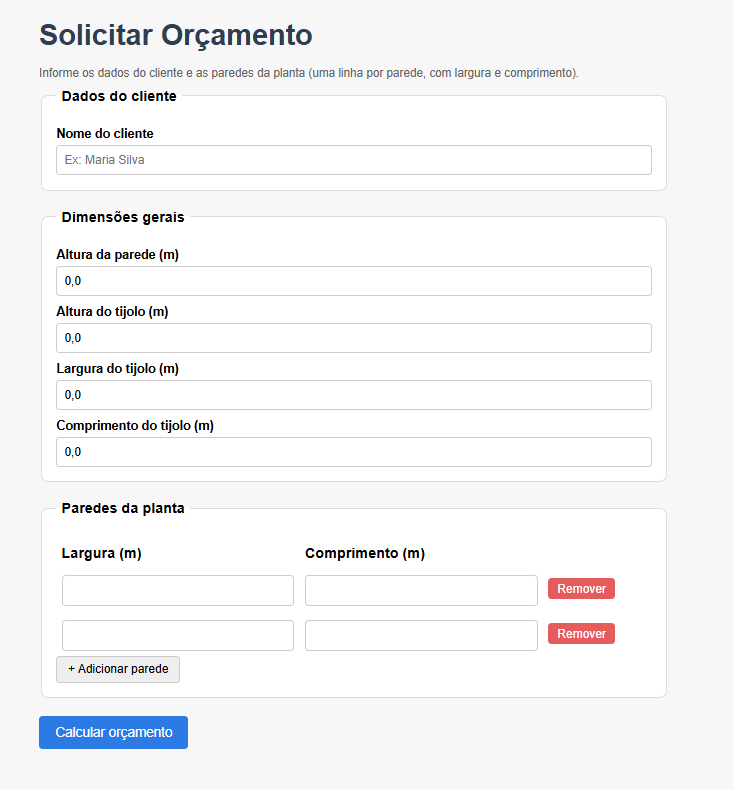

# Calculadora de Materiais para Obra Residencial

## Descrição
Aplicação desenvolvida em Java com Spring Boot para cálculo de materiais utilizados em obras residenciais. Feito como projeto para a disciplina de Desenvolvimento de Sistemas.

O sistema calcula:
* Volume de concreto para vigas baldrame
* Quantidade de tijolos para paredes

Além do cálculo, o sistema permite que o usuário **submeta uma solicitação de orçamento completa** através de uma tela web, informando os dados do cliente e as paredes da planta da casa. O orçamento gerado é **persistido no banco de dados** e pode ser **consultado posteriormente por número ou por nome do cliente**.



## Tecnologias Utilizadas
* Java 17
* Spring Boot
* Spring Web
* Spring Validation
* Spring Data JPA
* Thymeleaf (interface web)
* Banco de dados H2
* Swagger (OpenAPI)
* Maven

## Como executar
1. Clonar o repositório
2. Abrir o projeto no IntelliJ IDEA
3. Rodar a classe principal (`CalculadoraObraApplication`)
4. Acessar o Swagger (endpoints de cálculo): http://localhost:8080/swagger-ui/index.html
5. Acessar a tela de solicitação de orçamento: http://localhost:8080/orcamentos/novo
6. Acessar a tela de busca de orçamentos: http://localhost:8080/orcamentos/buscar
7. Console do banco H2 (opcional, para inspecionar os dados): http://localhost:8080/h2-console
   * JDBC URL: `jdbc:h2:mem:calculadoraobra`
   * Usuário: `sa` — Senha: *(em branco)*

## Arquitetura
O projeto foi organizado em camadas:
* **Controller**: responsável pelos endpoints da API (cálculo de materiais) e pelas telas web (solicitação e busca de orçamentos)
* **Service**: responsável pelas regras de negócio (cálculo de materiais e orquestração do orçamento)
* **DTO**: responsável pela comunicação de dados de entrada e saída
* **Model**: entidades persistidas no banco de dados (`Orcamento` e `Parede`)
* **Repository**: acesso e consulta dos dados persistidos

## Endpoints de Cálculo (API REST)

### 🔹 Concreto
`POST /api/materiais/concreto`

Exemplo:
```json
{
  "altura": 0.3,
  "arestas": [
    { "largura": 0.2, "comprimento": 10 },
    { "largura": 0.2, "comprimento": 8 }
  ]
}
```

Resposta:
```json
{
  "resultado": 1.08
}
```

### 🔹 Tijolos
`POST /api/materiais/tijolos`

Exemplo:
```json
{
  "alturaTijolo": 0.2,
  "larguraTijolo": 0.1,
  "comprimentoTijolo": 0.3,
  "arestas": [
    { "largura": 3, "comprimento": 10 },
    { "largura": 3, "comprimento": 8 }
  ]
}
```

Resposta:
```json
{
  "resultado": 900.0
}
```

### Validações
* Valores devem ser positivos;
* Lista de arestas não pode ser vazia.

### Fórmulas utilizadas

**Concreto:**
```
Volume = largura × altura × comprimento
```

**Tijolos:**
```
Quantidade = área da parede / área do tijolo
```

## Módulo de Orçamento (Interface Web)

Além da API de cálculo, o sistema conta com uma interface web completa para gerenciamento de orçamentos:

### 🔹 Solicitar orçamento
`GET /orcamentos/novo` — Exibe o formulário de solicitação.
`POST /orcamentos` — Recebe os dados do formulário (nome do cliente, dimensões, lista de paredes), calcula o volume de concreto e a quantidade de tijolos, e persiste o orçamento no banco de dados junto com as paredes informadas.

A planta da casa é informada pelo usuário como uma **lista dinâmica de paredes** (cada uma com largura e comprimento), adicionadas ou removidas diretamente na tela, sem necessidade de upload de arquivos ou desenho técnico.

### 🔹 Buscar orçamento
`GET /orcamentos/buscar` — Exibe a tela de busca.
`GET /orcamentos/buscar/numero?numero={id}` — Busca um orçamento pelo número (ID).
`GET /orcamentos/buscar/nome?nome={nome}` — Busca orçamentos pelo nome do cliente (busca parcial, sem diferenciar maiúsculas/minúsculas).

### Persistência
* **Tabela `orcamentos`**: armazena nome do cliente, volume de concreto calculado, quantidade de tijolos, altura, dimensões do tijolo e data de criação.
* **Tabela `paredes`**: armazena cada parede informada (largura e comprimento), relacionada ao orçamento correspondente (`orcamento_id`).

## Plano de Teste
O plano de teste manual, com casos de teste executados e evidências (capturas de tela) dos fluxos de solicitação, cálculo, persistência e busca de orçamentos, foi entregue separadamente ao professor.
